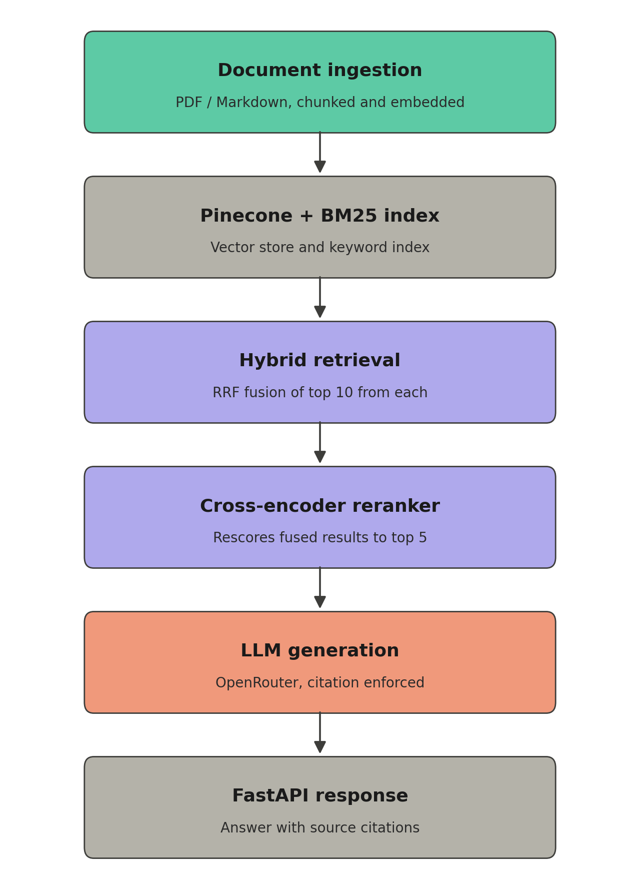
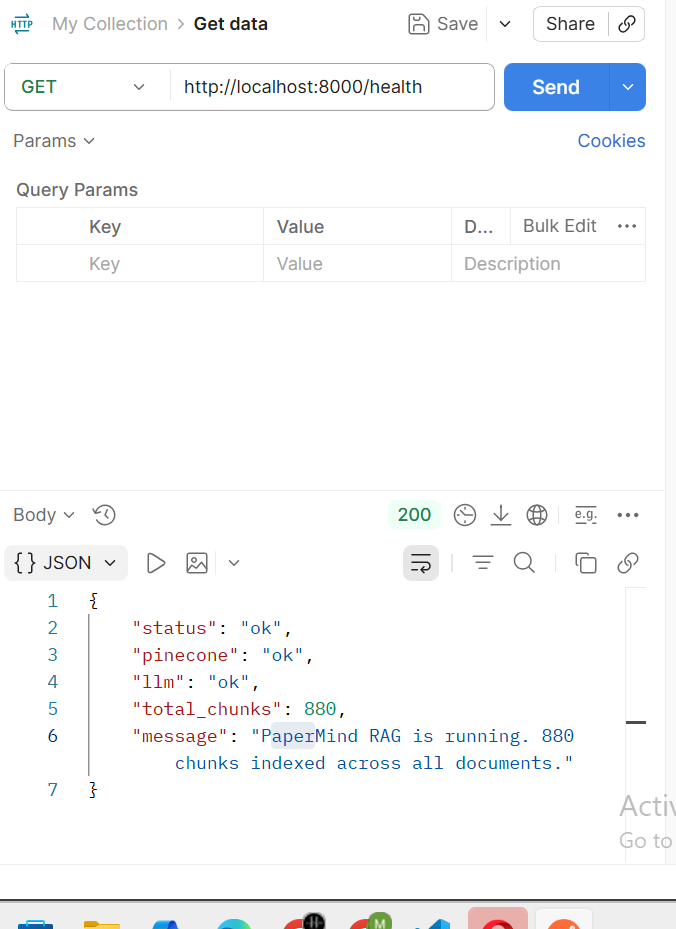
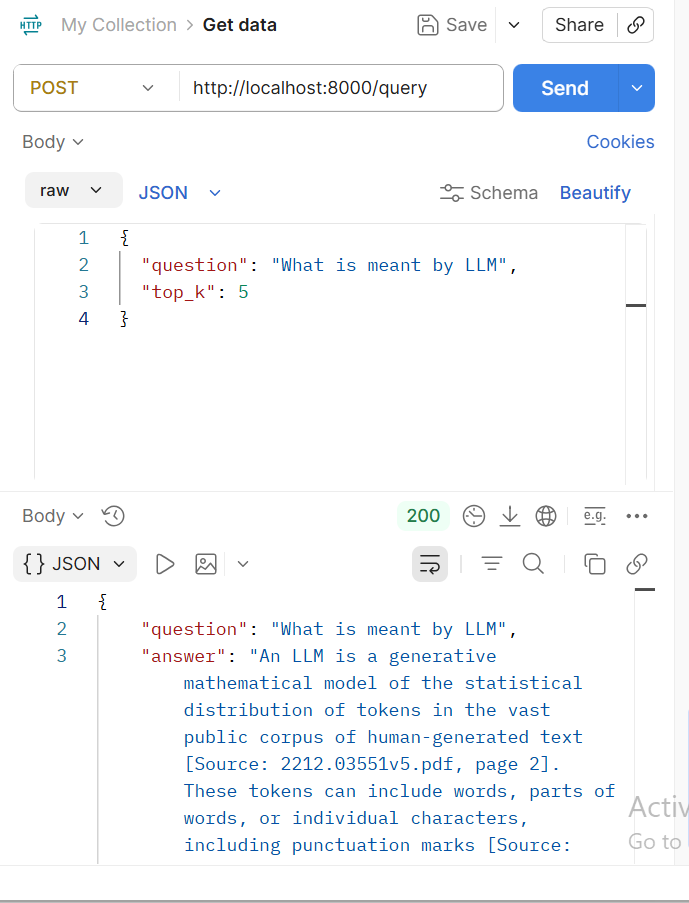
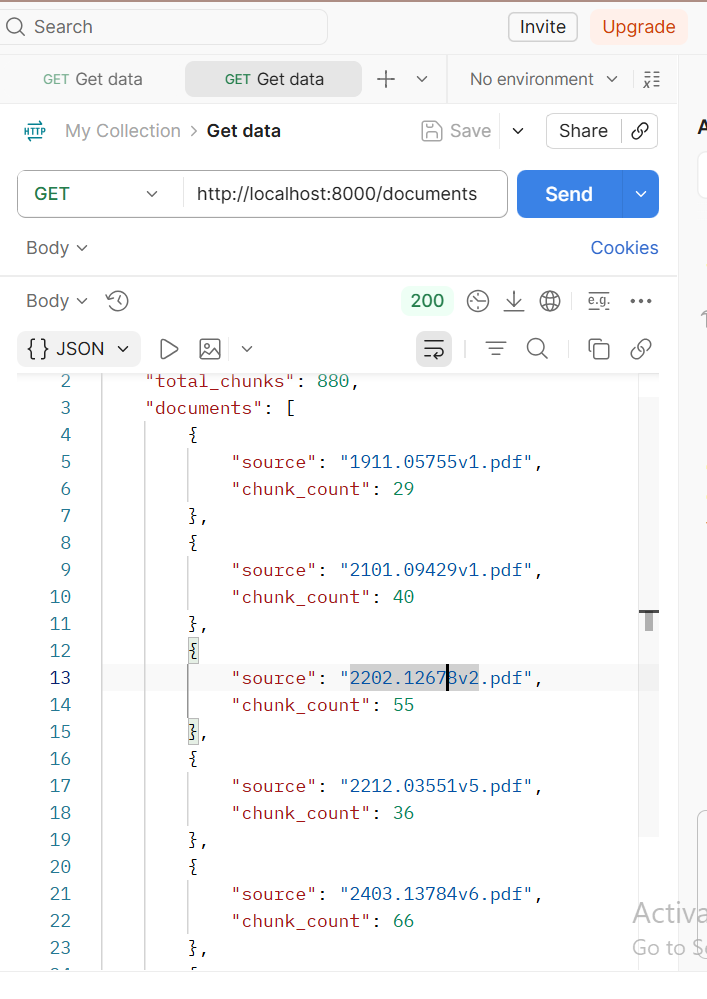
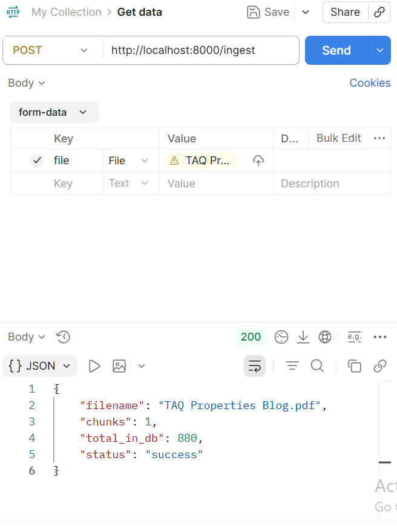
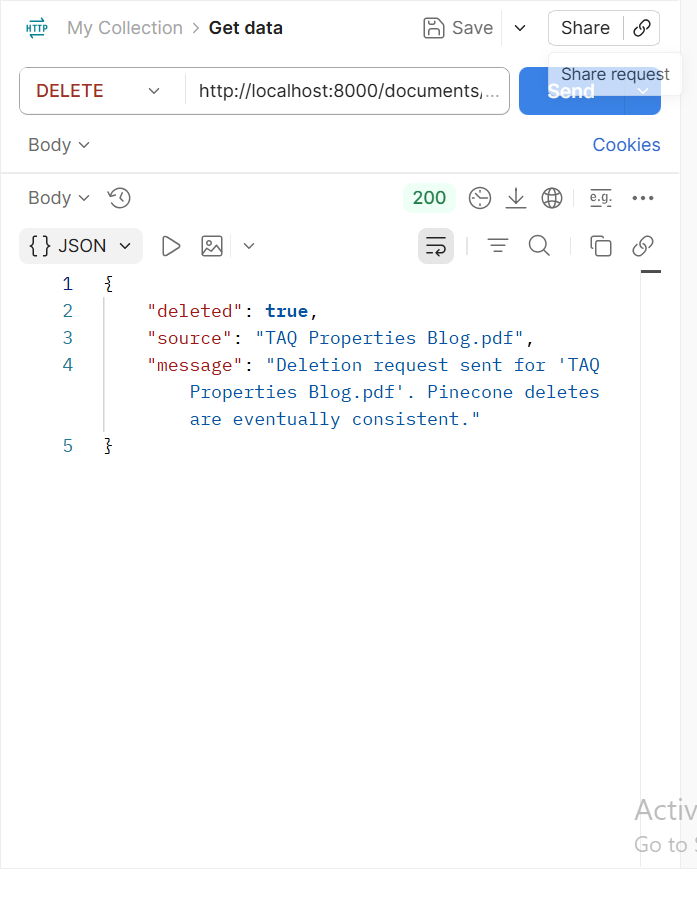
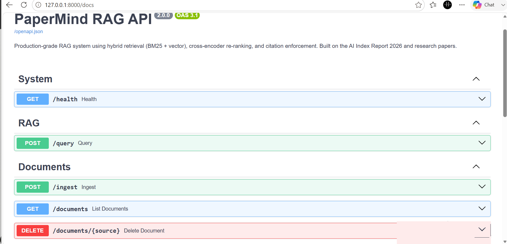
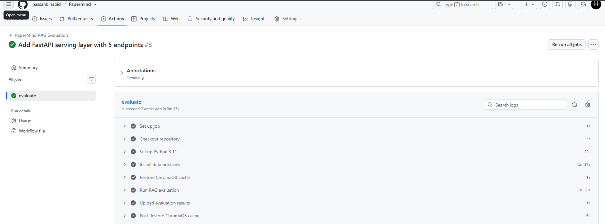
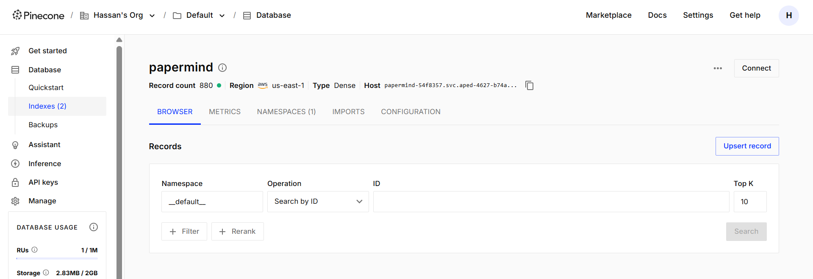

<div align="center">

# PaperMind: Citation-Grounded RAG with Hybrid Search & Regression-Gated CI

**Production-grade retrieval-augmented generation for question-answering over PDF and Markdown documents.**

[](https://www.python.org/)
[](https://fastapi.tiangolo.com/)
[](https://www.pinecone.io/)
[](https://www.docker.com/)
[](https://github.com/features/actions)
[](https://papermind-698756450548.us-central1.run.app)
[](#)

**[🔗 Live Demo](https://storage.googleapis.com/papermind-frontend-hassan/index.html)** · **[📄 API Docs](https://papermind-698756450548.us-central1.run.app/docs)**

</div>

---

PaperMind combines hybrid retrieval (keyword + semantic), cross-encoder re-ranking, and strict citation enforcement so answers are always grounded in the source documents rather than model guesswork.

Built on top of the AI Index Report 2026 and other research papers, PaperMind exposes a FastAPI REST API (and a lightweight Streamlit UI) for uploading documents and asking questions against them, with every answer traceable back to a specific file and page.

## Live Demo

| Item | Link |
|---|---|
| **Frontend (chat UI)** | [papermind-frontend-hassan](https://storage.googleapis.com/papermind-frontend-hassan/index.html) |
| **API base URL** | `https://papermind-698756450548.us-central1.run.app` |
| **Interactive API docs (Swagger)** | [/docs](https://papermind-698756450548.us-central1.run.app/docs) |
| **Health check** | [/health](https://papermind-698756450548.us-central1.run.app/health) |

The backend runs on Google Cloud Run and the frontend is a static single-page app hosted on Google Cloud Storage, calling the live API directly from the browser.

## Table of Contents

- [Features](#features)
- [Architecture](#architecture)
- [Tech Stack](#tech-stack)
- [How to Run Locally](#how-to-run-locally)
- [Running with Docker](#running-with-docker)
- [Deploying to Google Cloud Run](#deploying-to-google-cloud-run)
- [API Endpoints](#api-endpoints)
- [API in Action](#api-in-action)
- [CI/CD Pipeline](#cicd-pipeline)
- [Vector Store](#vector-store)
- [Interactive API Docs](#interactive-api-docs)
- [Evaluation Results](#evaluation-results)

---

## Features

- **Hybrid retrieval** — combines BM25 keyword search with Pinecone vector search, fused via Reciprocal Rank Fusion (RRF)
- **Cross-encoder re-ranking** — rescores the fused candidates by reading the query and each chunk together for higher precision
- **Citation enforcement** — every answer must cite `[Source: filename, page N]` for each claim, or the pipeline falls back to a refusal rather than an ungrounded answer
- **FastAPI REST API** — with interactive Swagger docs at `/docs`
- **Automated evaluation** — a golden dataset of 50 question/answer pairs scored for pass rate and faithfulness, wired into CI

## Architecture

The pipeline runs in two phases: an **ingestion phase** that chunks and indexes documents, and a **query phase** that retrieves, re-ranks, and generates a grounded answer.

<div align="center">

</div>

### Ingestion

- PDFs are parsed page-by-page (`pypdf`) and Markdown files are read directly; text is split into ~600-token chunks with 100-token overlap.
- Chunks are embedded locally with `sentence-transformers` (`all-MiniLM-L6-v2`, 384-dim, no API key required).
- Embeddings are upserted into a Pinecone serverless index; the same chunks are tokenized and written to a local BM25 index (`rank-bm25`, persisted as JSON).

### Query

1. **Hybrid retrieval** — the query is embedded and matched against Pinecone (semantic top 10) while BM25 independently scores keyword matches (top 10). Reciprocal Rank Fusion (k=60) merges both ranked lists into one.
2. **Re-ranking** — a cross-encoder (`cross-encoder/ms-marco-MiniLM-L-6-v2`) reads (query, chunk) pairs directly and rescores the top 10 fused candidates down to the 5 most relevant.
3. **Generation** — the top 5 chunks are formatted into a strict prompt (`prompts/prompts.yaml`) and sent to Groq (`openai/gpt-oss-20b`) at `temperature=0.1` with a 2048-token output budget.
4. **Citation enforcement** — the raw answer is checked for `[Source: ...]` citations or an explicit refusal phrase; if neither is present, the pipeline overrides the answer with a "cannot answer from the provided documents" response rather than returning an ungrounded claim.

> **Note on the generation model:** the pipeline originally targeted OpenRouter (`openrouter/auto`), but production now runs on Groq's `openai/gpt-oss-20b` after OpenRouter's routed models became unreliable for this use case. `gpt-oss-20b` is a reasoning model — it spends part of its token budget on internal reasoning before writing the visible answer, so `MAX_OUTPUT_TOKENS` was raised from an initial 256 to 2048 to avoid truncated/empty responses (a further bump to ~3000–4000 may be needed for long, table-formatted answers). `temperature` is explicitly set to `0.1`: at the provider default (~1.0), answer phrasing varied enough between runs that citation formatting was occasionally dropped even when the underlying facts were correct — a low temperature keeps citation formatting consistent.

## Tech Stack

| Layer | Technology | Purpose |
|---|---|---|
| API framework | FastAPI + Uvicorn | REST API, request validation, auto-generated `/docs` |
| UI | Streamlit | Lightweight chat interface for manual testing |
| Embeddings | sentence-transformers (`all-MiniLM-L6-v2`) | Local, no-API-key text embeddings (384-dim) |
| Vector store | Pinecone (serverless, AWS us-east-1) | Persistent semantic search, survives restarts |
| Keyword search | rank-bm25 (BM25Okapi) | Exact-term and keyword matching, complements vector search |
| Fusion | Reciprocal Rank Fusion (custom) | Merges vector + BM25 rankings into one list |
| Re-ranking | sentence-transformers CrossEncoder (`ms-marco-MiniLM-L-6-v2`) | Precision rescoring of fused candidates |
| Generation | OpenAI SDK → Groq (`openai/gpt-oss-20b`) | LLM answer generation with citation prompting, `temperature=0.1` for consistent citation formatting |
| Document parsing | pypdf | PDF text extraction, page-level chunking |
| Config | python-dotenv, PyYAML | Environment variables and externalized prompts |
| Deployment | Docker + Google Cloud Run (backend), Google Cloud Storage static hosting (frontend) | Live production deployment |
| Secrets | GCP Secret Manager | `GROQ_API_KEY` and `PINECONE_API_KEY`, injected via `--set-secrets` at deploy time |
| CI / evaluation | GitHub Actions (`eval.yml`) | Runs the golden-dataset evaluation on push |

## How to Run Locally

**Prerequisites**
- Python 3.11+ (note: the pinned ML dependencies do not build on 3.14 — use 3.11 for local work)
- A Groq API key ([console.groq.com/keys](https://console.groq.com/keys))
- A Pinecone API key ([pinecone.io](https://www.pinecone.io/))

**1. Clone and install**
```bash
git clone <your-repo-url>
cd Papermind
pip install -r requirements.txt
```

**2. Configure environment variables**

Create a `.env` file in the project root:
```
GROQ_API_KEY=your_groq_key_here
PINECONE_API_KEY=your_pinecone_key_here
```

**3. Ingest documents**

Place PDF or Markdown files in `data/docs/`, then run:
```bash
python main.py
```
This chunks and embeds the documents, upserts them into Pinecone, builds the local BM25 index, and runs a sample query to confirm everything works end to end.

**4. Start the API**
```bash
uvicorn app.api:app --reload --port 8000
```
- Interactive docs: `http://localhost:8000/docs`
- Health check: `http://localhost:8000/health`

**5. (Optional) Start the Streamlit UI**
```bash
streamlit run streamlit_app.py
```

## Running with Docker

```bash
docker-compose up --build
```
This starts the API on port 8000 and mounts a volume so the BM25 index persists across container restarts (Pinecone handles vector persistence in the cloud).

To run ingestion as a one-off task instead:
```bash
docker-compose run --rm ingest
```

## Deploying to Google Cloud Run

The live deployment builds the container via Cloud Build (no local Docker required) and deploys it to Cloud Run, with secrets pulled from GCP Secret Manager.

**Build:**
```powershell
gcloud builds submit --tag us-central1-docker.pkg.dev/papermind-demo-hassan/papermind-repo/papermind:latest .
```

**Deploy:**
```powershell
gcloud run deploy papermind --image=us-central1-docker.pkg.dev/papermind-demo-hassan/papermind-repo/papermind:latest --platform=managed --region=us-central1 --allow-unauthenticated --memory=2Gi --timeout=300 --set-env-vars=FRONTEND_ORIGIN=https://storage.googleapis.com --set-secrets=GROQ_API_KEY=GROQ_API_KEY:latest --set-secrets=PINECONE_API_KEY=PINECONE_API_KEY:latest
```

The Cloud Run service account needs `roles/secretmanager.secretAccessor` on both secrets, or the deploy will succeed but requests will fail with a permission error.

**Frontend (static site on Google Cloud Storage):**
```powershell
gsutil mb -l us-central1 gs://papermind-frontend-hassan
gsutil web set -m index.html gs://papermind-frontend-hassan
gsutil cp frontend/index.html gs://papermind-frontend-hassan/index.html
gsutil iam ch allUsers:objectViewer gs://papermind-frontend-hassan
```
`FRONTEND_ORIGIN` on the backend must include the frontend's exact origin for CORS to allow browser requests.

**Logs:**
```powershell
gcloud run services logs read papermind --region=us-central1 --limit=50
```

**Cold start note:** both embedding models (`all-MiniLM-L6-v2` and the cross-encoder) are baked into the Docker image at build time rather than downloaded at runtime — this avoids Hugging Face Hub rate limits on Cloud Run's shared IP ranges and improves cold-start latency.

## API Endpoints

Base URL when running locally: `http://localhost:8000`

| Method | Endpoint | Description |
|---|---|---|
| `GET` | `/health` | Reports overall system status, Pinecone connectivity, LLM key presence, and total indexed chunks |
| `POST` | `/query` | Core RAG endpoint — runs hybrid retrieval → re-ranking → generation → citation check, returns the answer and its sources |
| `POST` | `/ingest` | Upload a `.pdf` or `.md` file (multipart form) — chunks, embeds, and stores it, then rebuilds the BM25 index |
| `GET` | `/documents` | Lists all documents currently indexed in Pinecone with their chunk counts |
| `DELETE` | `/documents/{source}` | Deletes all chunks belonging to a given source filename from Pinecone |

**Example: `POST /query`**

Request:
```json
{
  "question": "What are the key AI trends highlighted in this report?",
  "top_k": 5
}
```

Response:
```json
{
  "question": "What are the key AI trends highlighted in this report?",
  "answer": "... [Source: ai_index_report_2026.pdf, page 12] ...",
  "sources": [
    { "source": "ai_index_report_2026.pdf", "page": 12 }
  ],
  "pipeline": "phase2_hybrid_rerank"
}
```

## API in Action

<table>
<tr>
<td width="50%">

<p align="center"><em>GET /health — system status, Pinecone connectivity, and LLM key check</em></p>
</td>
<td width="50%">

<p align="center"><em>POST /query — generated answer with source citations</em></p>
</td>
</tr>
<tr>
<td width="50%">

<p align="center"><em>GET /documents — indexed documents with per-source chunk counts</em></p>
</td>
<td width="50%">

<p align="center"><em>POST /ingest — uploading and indexing a new document</em></p>
</td>
</tr>
<tr>
<td width="50%">

<p align="center"><em>DELETE /documents/{source} — removing a document's chunks</em></p>
</td>
<td width="50%">

<p align="center"><em>Interactive Swagger docs auto-generated at /docs</em></p>
</td>
</tr>
</table>

## CI/CD Pipeline

Every push runs the golden-dataset evaluation automatically via GitHub Actions (`.github/workflows/eval.yml`) — checkout, dependency install, ChromaDB cache restore, evaluation run, and results upload, all gated on success.

<div align="center">

</div>

## Vector Store

Document chunks are embedded and persisted in a Pinecone serverless index (AWS `us-east-1`), giving the system durable semantic search that survives restarts and redeployments.

<div align="center">

</div>

## Interactive API Docs

FastAPI auto-generates a full Swagger UI at `/docs`, covering all five endpoints grouped by tag (System, RAG, Documents) with request/response schemas ready to test in-browser.

## Evaluation Results

PaperMind is evaluated against a golden dataset of 50 question/answer pairs (25 factual, 15 conceptual, 10 intentionally unanswerable) using an LLM-as-judge faithfulness score, wired into CI via `.github/workflows/eval.yml`.

| Metric | Result |
|---|---|
| Pass rate | 74% (37/50) |
| Average faithfulness | 0.65 |
| Faithfulness threshold | ≥ 0.45 |
| Judge model | `openrouter/auto` |
| Overall CI status | ✅ Pass |

Faithfulness is scored on a 0.0–1.0 scale by fact-checking each generated answer against its retrieved context; refusals on unanswerable questions are automatically scored 1.0 since declining to answer is the correct behavior for that category.

> **Note:** these numbers predate the switch to Groq's `openai/gpt-oss-20b` and the `temperature=0.1` fix described above — re-running the eval suite against the current production config is a planned follow-up to confirm these figures still hold.

**Run the evaluation yourself:**
```bash
python eval/evaluate.py
```
Optional flags: `--category factual|conceptual|unanswerable` to filter, `--sample N` to evaluate a random subset.

---

<div align="center">
<sub>Built by Hassan Bin Abid</sub>
</div>
